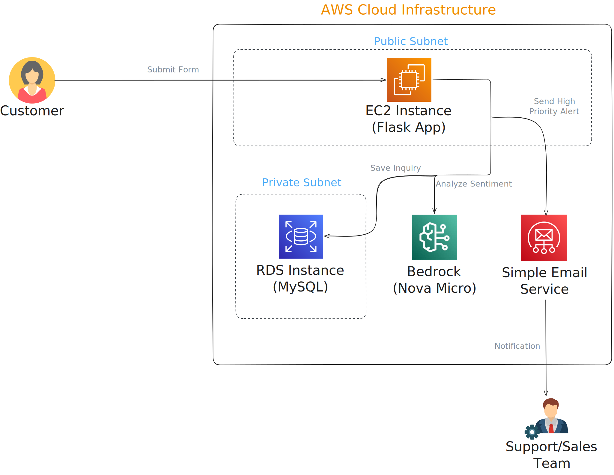
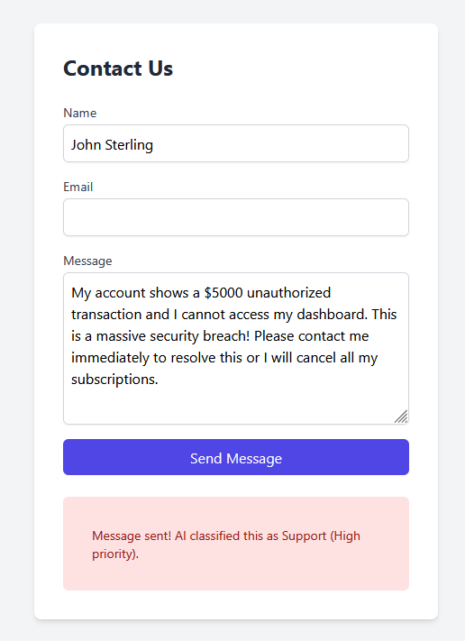
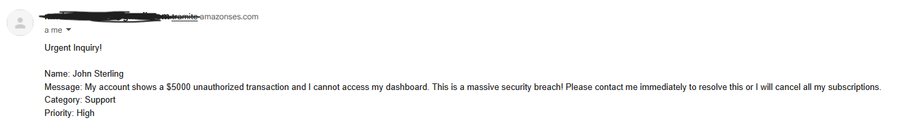
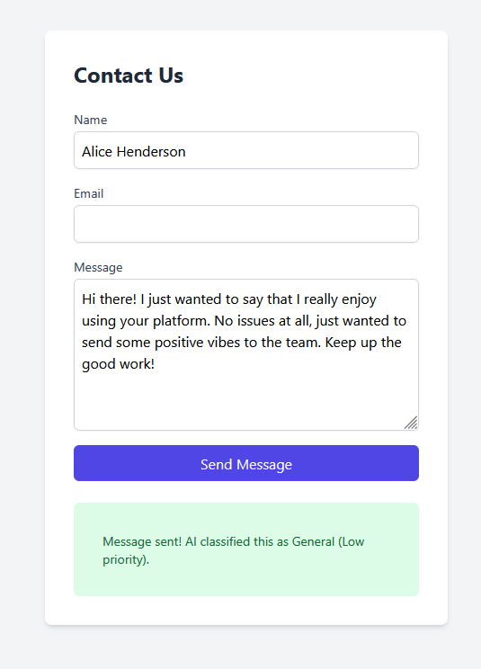

# AWS AI Customer Support Agent

## Project Overview
This project is an AI-powered Full-Stack application designed to revolutionize customer inquiry management. By integrating Generative AI into the communication pipeline, it transforms chaotic contact form submissions into a structured, prioritized, and actionable stream of data, ensuring that high-value sales leads and critical support issues never fall through the cracks.

> **Why this matters:** Traditional keyword-based filters often fail to capture nuance. This system uses Large Language Models (LLMs) to understand intent and sentiment, allowing businesses to respond to "silent" opportunities and urgent frustrations with surgical precision.

## Architecture
The system employs a hybrid architecture, combining traditional virtualized compute (EC2) with modern managed AI and database services.



## Tech Stack
*   **Languages:** Python 3.11 (Flask, SQLAlchemy), HTML/JS.
*   **Infrastructure as Code:** Terraform (Modularized).
*   **AWS Services:** EC2, Bedrock (Nova Micro), RDS (MySQL), SES, IAM, VPC.
*   **Tooling:** `boto3` (AWS SDK), `pymysql`, `dotenv`.

## Technical Implementation
The core logic resides in a robust backend that orchestrates multiple AWS services:

*   **Intelligent Classification:** Instead of rigid "if/else" logic, the system invokes **Amazon Bedrock** (`nova-micro`). It passes the customer's message through a specialized prompt to extract the intent (Sales, Support, General) and assign a priority (High, Medium, Low).
*   **Relational Persistence:** Every interaction is stored in **Amazon RDS**. Using a traditional MySQL engine demonstrates the ability to manage structured datasets and relational queries.
*   **Automated Alerting Pipeline:** If the AI identifies an inquiry as "Sales" or "High Priority," the system triggers an **Amazon SES** event to notify stakeholders immediately.

### Case Study 1: High-Priority Support Request
When a user reports a critical issue (e.g., a security breach), the AI recognizes the urgency and triggers the full notification pipeline.

<details>
<summary><b>View Implementation Steps</b></summary>

*   **1. User Submission:** The user sends an urgent message via the web interface.
    
*   **2. Database Persistence:** The backend saves the inquiry with AI-assigned metadata.
    ```bash
    [ec2-user@ip-10-0-0-20 app]$ python3 -c "import os; from main import Inquiry..."
    Name: John Sterling | Category: Support | Priority: High
    ```
*   **3. Real-Time Alerting:** An instant notification is dispatched via Amazon SES.
    
</details>

### Case Study 2: Low-Priority Feedback
General feedback is classified as "General/Low," ensuring it is logged without disturbing the team.

<details>
<summary><b>View Implementation Steps</b></summary>

*   **1. User Submission:** Positive feedback is submitted.

    
*   **2. Database Persistence:** Logged efficiently for later review.
    ```bash
    [ec2-user@ip-10-0-0-20 app]$ python3 -c "import os; from main import Inquiry..."
    Name: Alice Henderson | Category: General | Priority: Low
    ```
</details>

## Production Verification
The system is built with production-grade standards:
*   **IAM Roles & Profiles:** Zero hardcoded credentials; EC2 uses instance profiles to securely interact with Bedrock, RDS, and SES.
*   **Modular IaC:** Infrastructure is fully defined in Terraform, allowing for reproducible environments.
*   **Security:** Database isolation in a private subnet with restricted security group access.

## Business Impact
*   **Maximized Revenue:** Identifies urgent sales inquiries in seconds.
*   **Reduced MTTR:** Automatically categorizes support tickets for faster resolution.
*   **Data-Driven Insights:** Provides a clean, SQL-searchable history of all customer interactions.

---
*Developed to demonstrate mastery of AI Integration, Relational Database Management (RDS), and Full-Stack Orchestration on AWS.*
